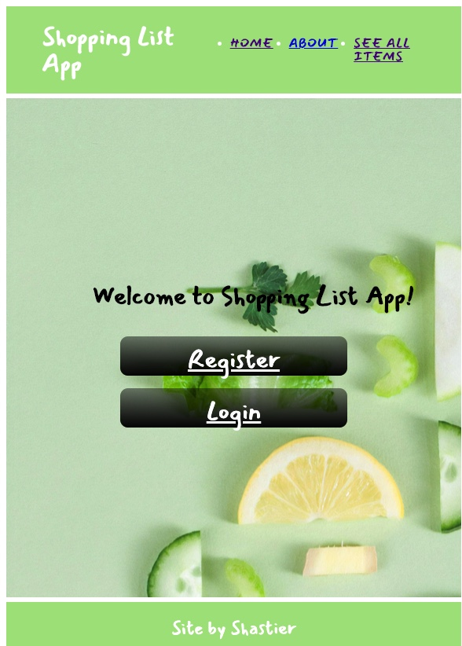

# Project 2: ShoppingListApp

"Shopping List App!" is an application software intended to be used by a household on a regular basis to track any new item that needs to be restocked in the house, specifically grocery. Traditionally this task has been accomplished using paper and pencil, but it is inefficient and time consuming. Instead, using the "Shopping List App" by the time the household has to go to the store, the shopping list will be already completed and accessible.

## Wireframes and user stories

Please click the link below to see wireframes and user stories.

[Wireframes and User Stories](./Wireframes.md).

## Technologies, APIs, and modules used

- **HTML / EJS**: Instead of sending static HTML pages to the client, a better approach was used: EJS as Template Engine to render information on the page. It also allowed to reuse components on different pages.
- **Node and Express**: Were used as server-side web application framework to build the server.
- **MVC Pattern**: Was used as architectural design pattern. 
- **SQL / PG-PROMISE**: Were used to persist data. Several tables were created to allow better data manipulation and functionality. Such as a cart to be shared by different users and an usser to have different carts, is an example of many to many relationship. Please see "Schema diagram" for more details related to the database. 
[Schema Diagram](./schema_diagram.md).
- **CSS & Design**: Was used to deliver a nice an pleacent user experience. 
- **Frontend JavaScript**: Some interactivity on the front end was included using DOM manipulation such as the color of the navigation bar to be colored once clicked.
- **Heroku Deployment**: Applied continuous integration on deployment.

## Code snippet 
How to manipulate checkbox using "body-parser"

## http routes
[http routes](./route-architecture.md).

## Agile methodology. 
- Basic kanban project board offered by GitHub was used througout the software development cycle. 

## Added bonus functionality:
- Authentication, as listed on the wireframes and user stories. 

## Link to deployed app

https://protected-castle-59971.herokuapp.com/

## Features to be added in a later version
- Allow users from the same household to share the same cart and have their own cart indivitually if needed.
- Create a dashboard to show all items by category, instead of listing them all in the same page.
- Not allow duplicate items on the cart, but add a quantity column to the cart_items table to allow the user to edit the quantity of an item in its cart.
- Add a search bar.
- Implement infinite scrolling. 

## Instructions for downloading the code and running it on localhost
- Fork and clone the repo.
- Provide your own node_modules package
- Create a .env file and include SECRET_KEY to allow authorization functionality to work.
- Create a psql database, and run Schema: shopping_list_Schema_postgres_create.sql, Seeds: seed.sql, and migrations in the order they were created by date, finally: Seed: the one with dates 20200814...
- Check below link: "Schema diagram" for more details related to the database. 
[Schema Diagram](./schema_diagram.md).
- If any issue is presented, please create an issue request on this repo.
