# Wireframes and User Stories!

Right-click & open in new window to see better!

## Home page

### Authorization require
- Will allow the user to register. Got to "Register" page if first time user. 
- If the user has already an account, allow it to login and go to its "Dashboard" page.

### No-Authorization require
- Will only see the "About" page, which will explain how to use the app and why it is needed.
- As added value, the About page will show general nutrition information in order to organize the food shopping process.

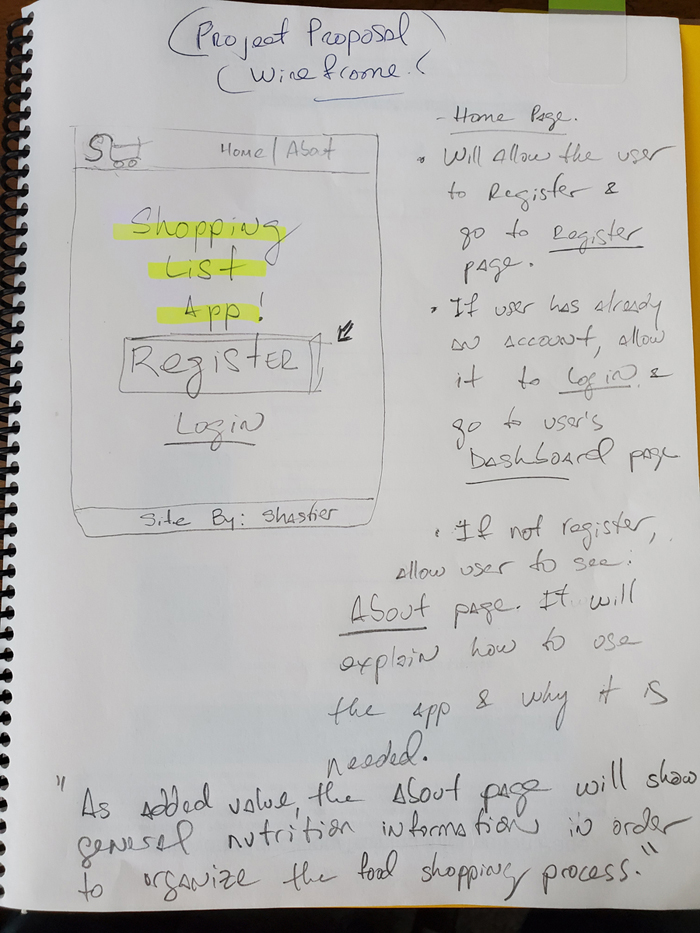

## Login / Registration flow

### Registration. First time user
- Allow user to register.
- Name, username and password are mandatory fields.
- Register button, will redirect to user's "Home" page.

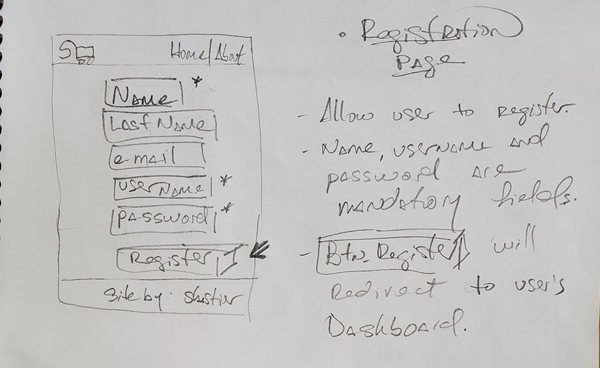

### Login. User who was previously registered. 
- Allow user to enter username & password. If that information matches with the DB's user login credentials 
then, redirect to user's "Home" page.
- Else, don't allow the user to login until the correct information is entered.
- Have a link to "Register" page on navegation bar.

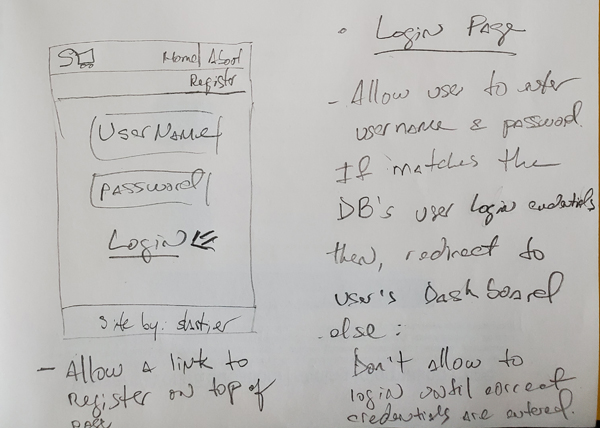

## User "Home" page
Quick access to:
- Add new item
- See list of its items
- Dashboard

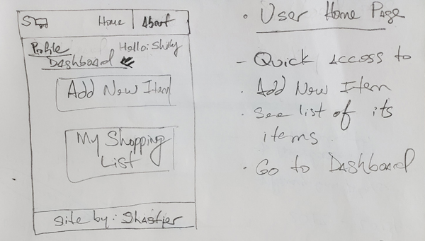

## Dashboard 
- Will show all shopping categories.
- Each category's box will have the total of products in that category (previously added by user).
- Once the user click that category's box, it will be redirected to that "Category" page from where the user can: see all,
add and edit an item.

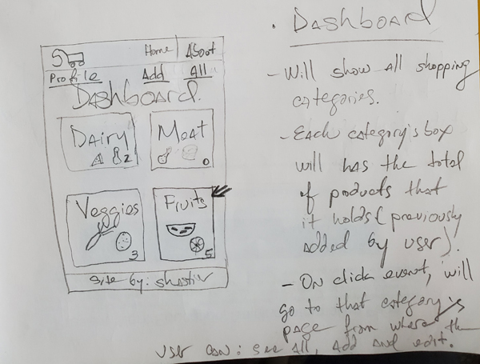

## Dashboard / get all items by category
- Will show a list of all items of current category with an option to: "Edit" or "Delete" that item.
- Add, will redirect to "Add New Item" page of current category. 

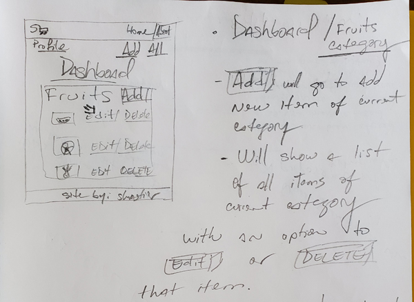

## Dashboard / Editing an item
- User will edit that particular item and click save.
- The database will be updated accordingly. 
- If the name changed and there is a picture, update the picture.

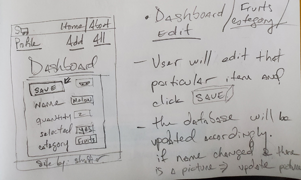

## Adding an item
There are two options: 

- From Dashboard / Category page:
Easy way for the user: it will only have to select the picture and update quantity. 
All data for this page will be uploaded from the database.
Once click add, the item will be added to the user's list of items.

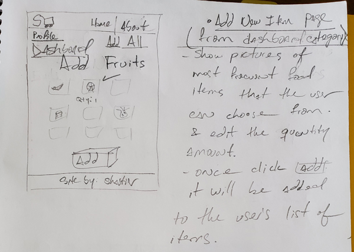

- From navigation bar: 
User can create a new item from scratch
Once click add, the item will be added to the user's list of items.
If the user don't want to add an item, can go back using links to "All" or "Dashboard"

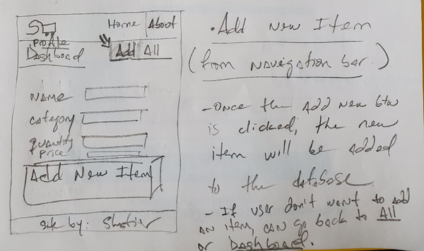

## Getting info from an/all item(s)
- Will show all items with its information: category, name, picture, quantity, and if it was selected
(added to its real shopping cart).
- On cart, once clicked: update it to "Yes" and cross out that item.
- Reset Cart, will update on-cart to "No" for all items.

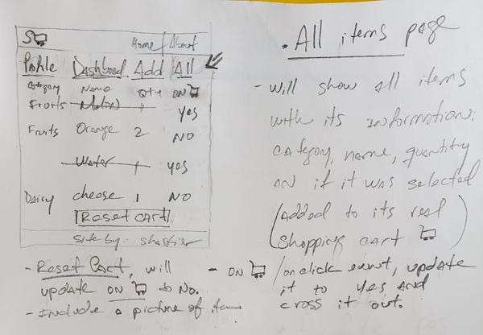

## Deleting an item
- Just delete that selected item from the database and remove it from the page.

## User Profile Page
- Will show user's personal information and allow it to "Edit" and "Save"

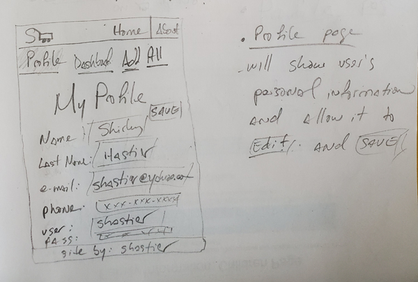
