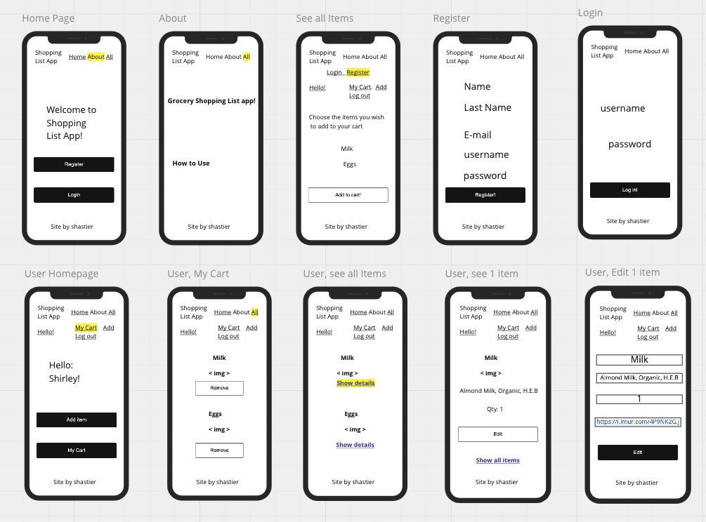

# Wireframes

Right-click & open in new window to see better!

# User Stories

## Home page
- The user will be able to see the 'About' page and 'See all Items'.
- Show welcome message. 
- Allow the user to register or login.

### Authorization require
- Will allow the user to register. Got to "Register" page if first time user. 
- If the user has already an account, allow it to login and go to its "Home" page.

### No-Authorization require
- Will only see the "About" page, which will explain how to use the app and why it is needed.

## Login / Registration flow

### Registration. First time user
- Allow user to register.
- Name, username and password are mandatory fields.
- Register button, will redirect to user's "Home" page.

### Login. User who was previously registered. 
- Allow user to enter username & password. If that information matches with the DB's user login credentials 
then, redirect to user's "Home" page.
- Else, don't allow the user to login until the correct information is entered.

## User "Home" page / Add new Item
- Add navigation bar on top with access to: User Homepage (Hello!), My Cart, Add, Log out.
Quick access to:
- Add new item. This will allow to add a new item to the database(not its cart), all users will be able to
 see it.
- See list of its items (My Cart)

## See all items 
- Will show a list of all items organized by category in ascending order with an option to show more details of that particular item. An "Edit" button will appear, but only if the user is registered will be able to edit the item, if the user is not registered, will be redirected to the login page.
- A checkbox on each item will allow the user to select it and add it to its cart, once clicked "Add Item" at the bottom of the page.

## Editing an item
- How to access: From the main navigation bar, "See all items" / show details / Edit.  
- User will edit that particular item and click save.
- The database will be updated accordingly. 

## Getting info from an item
- How to access: From the main navigation bar, "See all items" / show details. Will show all items with its information: name, picture, quantity.

## Deleting an item
- The items will only be deleted from the user's cart, not from the database. 
- How to access: User Homepage / My cart / delete